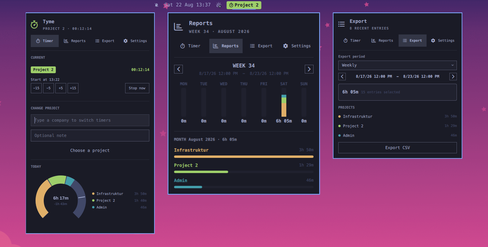

# Tyme

Tyme is a focused, local-first time tracker for the Omarchy bar. Track work by project, keep an eye on today's progress, review weekly and monthly activity, and export records when needed.



## Highlights

- Start, switch, and stop project timers from the centered bar.
- Adjust an active timer's start time in 5 or 15 minute steps.
- Use the project picker with typing, mouse selection, or Up/Down and Enter.
- See today's project-colored 10-hour gauge and progress against a configurable daily target.
- Review a weekly project breakdown and monthly totals.
- Export selected ranges as CSV files to `~/Downloads`.
- Choose project-colored, theme-colored, or plain bar labels.

## Install

Install from its public repository once published:

```sh
omarchy plugin add https://github.com/jheuing/omarchy-tyme.git --enable
```

For local development, place this directory at:

```text
~/.config/omarchy/plugins/ch.wertstifter.tyme/
```

Then validate and reload the shell:

```sh
omarchy plugin validate ~/.config/omarchy/plugins/ch.wertstifter.tyme
omarchy restart shell
```

## Use

Click the Tyme item in the bar, or assign a shortcut such as `SUPER + Y` to:

```sh
omarchy-shell shell toggle ch.wertstifter.tyme
```

### Optional `SUPER + Y` Shortcut

Add this line to `~/.config/hypr/bindings.lua`:

```lua
o.bind("SUPER + Y", "Tyme", "omarchy-shell shell toggle ch.wertstifter.tyme")
```

Reload Hyprland after saving the binding:

```sh
hyprctl reload
```

## Keyboard Interactions

- `SUPER + Y`: Open or close Tyme when the optional shortcut is configured.
- `Escape`: Close the Tyme panel.
- Left and Right arrows: Move between Timer, Reports, Export, and Settings when panel navigation has focus.
- Up and Down arrows: Move through visible project matches in the Timer project selector.
- `Enter` in the project selector: Start or switch to the selected project. With an active timer and no selected project, it stops the timer.
- `Enter` in the daily target or project name field: Save that field.

In the Timer tab, add projects in Settings, then choose one and start tracking. While a timer runs, choose another project to switch directly, or use `Stop now` in the Current section.

The daily target defaults to 8 hours and can be changed in Settings. The gauge always spans 10 hours so extra time remains visible.

## Data And Privacy

Tyme does not use a network service or an account. Its only runtime dependency is the system `python3` interpreter and Python's standard library.

Timer state is stored locally at:

```text
~/.local/state/omarchy/client-timer/state.json
```

Active timers are persisted immediately and survive an Omarchy Shell restart. The plugin only writes this state file and CSV files explicitly requested through Export; it does not overwrite unrelated user configuration.

## Remove

Disable and remove the plugin with:

```sh
omarchy plugin remove ch.wertstifter.tyme
```

Removal intentionally leaves your local time records in place. Delete the state file above only if you also want to permanently remove all Tyme data.

## License

Tyme is released under the [MIT License](LICENSE).
